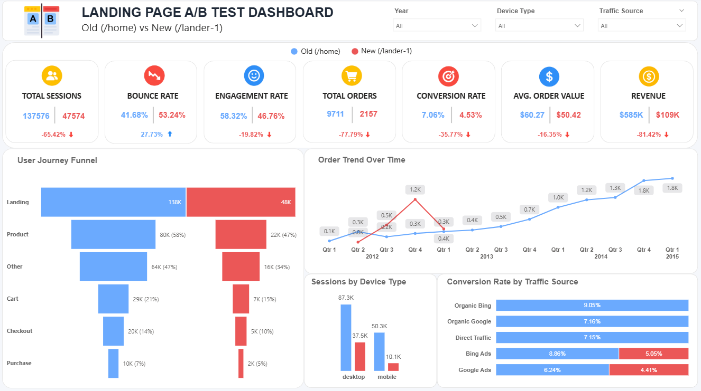
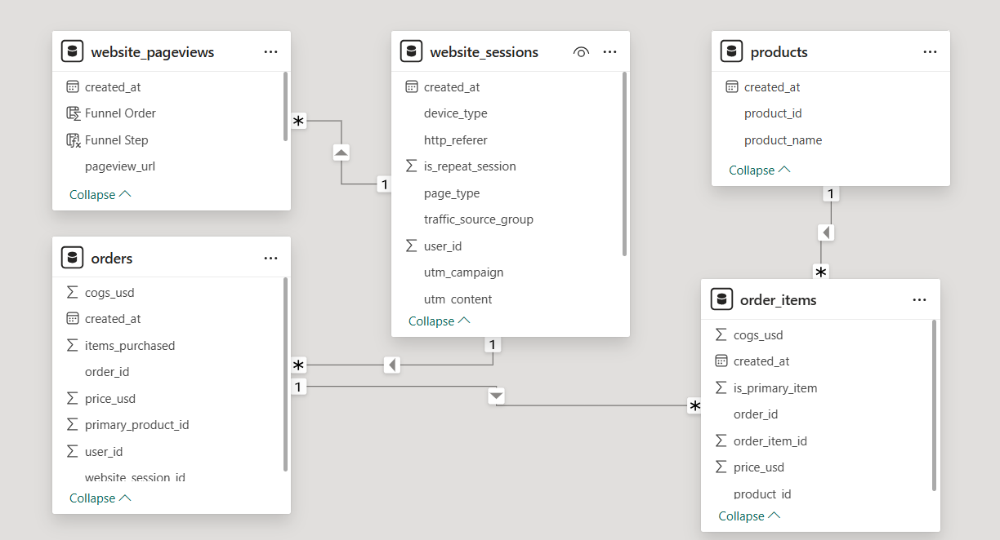

# Toy Store Landing Page A/B Testing Dashboard

> Built to analyze landing page performance, user behavior, conversion optimization, and marketing effectiveness for an e-commerce toy store using SQL and Power BI.

---

# Dashboard Preview

## Executive Dashboard

This dashboard provides a complete comparison between the old and new landing pages by analyzing sessions, engagement, bounce rate, conversion rate, revenue, funnel behavior, traffic sources, and device performance.

---

# Data Model & Relationships

## Power BI Relationship Model

The data model was designed using a star-schema style approach to ensure proper filter propagation and accurate KPI calculations across sessions, pageviews, orders, products, and order items.

---

# Problem Statement

An e-commerce toy store launched a new landing page as part of an A/B testing experiment to improve conversion and revenue performance.

The business wanted to understand:

- Is the new landing page performing better than the old page?
- Which landing page drives more conversions and revenue?
- Where are users dropping in the funnel?
- Which traffic sources perform best?
- Does device type affect conversion behavior?
- Why is the new landing page underperforming?
- Should the business continue using the new landing page?

This project answers these business questions using SQL-based data preparation and Power BI analysis.

---

# Dataset

The dataset contains user-level website interaction data from an e-commerce toy store.

## Tables Used

- `website_sessions`
- `website_pageviews`
- `orders`
- `order_items`
- `products`

---

# Dataset Details

- Website Sessions: **472K+**
- Website Pageviews: **1.18M+**
- Orders: **32K+**
- Order Items: **40K+**
- Refund Records: **4**

---

# Tools & Technologies Used

## SQL Server
- Data Cleaning
- Data Transformation
- Funnel Validation Queries
- KPI Validation Queries

## Power BI
- DAX Measures
- Interactive Dashboard
- Funnel Analysis
- KPI Cards
- Data Modeling

---

# SQL Work Performed

## 1. Traffic Source Classification

Created a new traffic classification system using SQL to group users into:

- Google Ads
- Bing Ads
- Social Media Ads
- Organic Google
- Organic Bing
- Direct Traffic

This helped analyze which channels generated high-quality traffic and conversions.

---

## 2. Landing Page Classification

Used SQL window functions and session-level logic to identify the first page visited by each user session.

A permanent `page_type` column was created to classify sessions into:

- Old Landing Page
- New Landing Page
- Ignore

This solved major filtering and attribution issues inside Power BI.

---

## 3. KPI Validation Using SQL

Validated all important business metrics directly in SQL:

- Total Sessions
- Bounce Rate
- Engagement Rate
- Total Orders
- Conversion Rate
- Average Order Value
- Revenue

This ensured Power BI calculations matched the raw database results accurately.

---

# What I Analyzed

## Landing Page Performance
- Old vs new landing page comparison
- Session behavior analysis
- Conversion performance comparison

## Funnel Analysis
- Landing to product drop-off
- Cart abandonment behavior
- Checkout completion analysis

## Traffic Source Analysis
- Paid vs organic traffic behavior
- Google Ads vs Bing Ads comparison
- Direct traffic analysis

## Device Analysis
- Desktop vs mobile conversion behavior
- Mobile engagement issues
- Device-level revenue comparison

## User Behavior Analysis
- Bounce rate
- Engagement rate
- Funnel progression
- Session quality

---

# Key Metrics Created

- Total Sessions
- Bounce Rate
- Engagement Rate
- Total Orders
- Conversion Rate
- Average Order Value
- Revenue
- Funnel Step Sessions

---

# Key Insights

## 1. The New Landing Page Failed Across Almost Every KPI

- The new landing page received around 47K sessions compared to nearly 137K on the old page
- Despite lower traffic volume, the new page still performed worse in bounce rate, engagement, conversion, revenue, and average order value
- This indicates that the issue was related to landing page experience rather than traffic quantity

---

## 2. Revenue Declined Much More Than Traffic

- Sessions dropped by around 65%
- Revenue declined by more than 81%
- This shows that both traffic quality and conversion quality became weaker on the new page

---

## 3. Users Dropped Heavily Immediately After Landing

- Funnel analysis showed the biggest drop occurred between the landing page and product page
- More than half of the users left before exploring products
- This proves the problem started at the first interaction stage itself

---

## 4. Paid Advertising Traffic Performed Poorly

- Most users visiting the new page came through paid ads
- Despite targeted ad traffic, conversion rates remained significantly lower
- This suggests a mismatch between advertisement messaging and landing page experience

---

## 5. Mobile Experience Performed Extremely Poorly

- Mobile conversion rate on the new page dropped close to 1.5%
- Desktop conversion remained better than mobile but still weaker than the old page
- This strongly suggests poor mobile responsiveness and usability issues

---

## 6. Average Order Value Also Declined

- Even users who converted spent less money on the new page
- This indicates weaker purchase confidence and lower-quality buying behavior

---

## 7. The Old Landing Page Improved Over Time

- The old page initially showed weak conversion performance in early years
- Performance improved steadily over time
- The new page appeared only during limited periods and was likely stopped after poor results

---

# Business Conclusion

The analysis strongly suggests that the new landing page should not replace the old version in its current form.

The new page:

- Increased bounce rate
- Reduced engagement
- Lowered conversion rate
- Reduced average order value
- Reduced revenue significantly
- Performed poorly on mobile devices
- Generated weak results from paid advertising traffic

The main issue appears to be weak user motivation and poor first-page communication rather than checkout or payment problems.

---

# Future Recommendations

- Continue using the old landing page while improving weak sections of the new version
- Improve mobile responsiveness and CTA visibility
- Optimize above-the-fold content and first impression
- Improve consistency between advertisements and landing page messaging
- Add stronger trust-building elements such as reviews and testimonials
- Conduct separate desktop and mobile A/B tests
- Use heatmaps and session recordings to identify user drop-off points
- Simplify the landing page structure and reduce distractions
- Improve product discovery and navigation flow

---

# Contact

Email: ishantkatiyar68@gmail.com  
LinkedIn: https://www.linkedin.com/in/ishantkatiyar/
